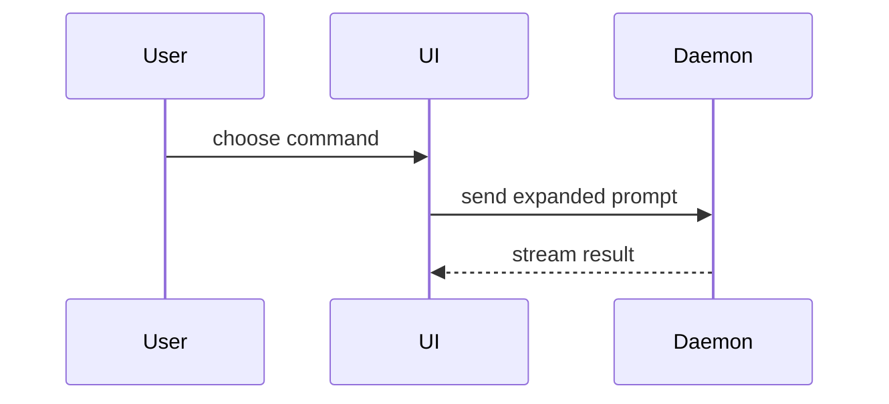

# Create PR

Run this workflow whenever it's time to create a PR — after verification passes, or when the user explicitly asks to open a pull request. Opening a PR publishes repository changes, so it needs the user's explicit authority; never infer it.

## Process

1. Identify the exact candidate: working branch, commit SHA, and base branch. If the branch is not pushed yet, commit and push first (commit message format via `git-commits`).
2. Collect proof. Reuse the freshest evidence for this exact candidate — verification result files, before/after output, screenshots. In the `issue-to-pr` pipeline, reuse the artifacts under `{ISSUE_DIR}/verification/` rather than rerunning checks. If nothing proves the claim, stop and say what evidence is missing; never write a PR body on unproven claims.
3. Write the PR body to a file using the template below.
4. Open the PR:

   ```bash
   gh pr create --title "<short imperative title>" --body-file <pr-body-file>
   ```

   Using a body file avoids shell-quoting problems with long, formatted bodies.
5. Report the pushed branch and the PR URL, with readiness state ("opened and ready for review").

Review policy and merging stay outside this skill: it writes the body and opens the PR, nothing further.

## Template

Use this template for the PR body:

```markdown
## Summary

<diagram, diff-sketch, or tree>

## Evidence

- **Before:** <screenshot/output/failing test run>
  **After:** <screenshot/output/passing test run>

## Merge Danger

**Door:** <one-way or two-way>

<optional: description>

**Blast Radius:** <one-word description>

<optional: potential ramifications of merge>
```

## Sections

Skip preambles and keep prose brief. Use the project's domain language from `GLOSSARY.md` when present.

### Summary

Pick the smallest view that makes the key point clear.

- Show logic or an algorithm as pseudocode:

```text
on(save)
  if content is unchanged
    return cached result
  write new content
  return fresh result
```

- Show runtime control flow as a call tree:

```text
submitForm
  createSession
    persistPrompt
    launchAgent
  navigateToSession
```

- Show UI structure as a component tree, including state and module boundaries that matter:

```text
<SessionPage> (apps/example/src/routes/session.tsx)
  useSessionEvents()
  <SessionToolbar>
    <RunSkillButton> (packages/ui)
```

- Show file responsibility or a broad refactor as a shallow file tree:

```text
src/
├── commands/       # parses user actions
├── sessions/       # owns session state
└── transport/      # sends API requests
```

- Show component interaction, control flow, or data flow with Mermaid:



- Use `diff` when the point is what changes and the surrounding shape already exists. Match the diff shape to the topic.

For a component change:

```diff
 <SessionPage>
   useSessionEvents()
   <SessionToolbar>
+    <RunSkillButton />
   <SessionTimeline>
+    <SkillResultCard />
```

For a file-layout change:

```diff
 src/
 ├── commands/
+│   └── show-me.ts       # expands the slash command
 ├── sessions/
-└── transport.ts
+└── transport/
+    ├── client.ts
+    └── stream.ts
```

For a call-tree or call-stack change:

```diff
 submitForm
   createSession
     persistPrompt
+    expandSkillMention
     launchAgent
-  navigateToSession
+  navigateToSession
+    subscribeToEvents
```

For a state or control-flow change:

```diff
 on(save)
-  write content
+  if content is unchanged
+    return cached result
+  write new content
+  invalidate cache
```

- Show the whole block when most of it is new, when omitted context would hide ownership or order, or when the reader needs a copyable target shape:

```ts
function expandSkill(command: string): string {
  const skillName = command.slice(1);
  return `use the ${skillName} skill`;
}
```

#### Guidance

Place each visual next to the short text it supports. Keep only the calls, files, props, states, and boundaries needed to answer the reviewer's current question or the options that resolve the current discussion point.

You may use one of these, you may use several, it is unlikely you will use all of them. Use your judgement and don't overwhelm the reviewer.

### Evidence

Concrete evidence that the change works. Show a before and after.

Screenshots are S-tier — when the environment is set up for it and the change is visual.

Execution-based evidence is A-tier: test results, console output. Show the exact test that now fails before and passes after.

### Merge Danger

Describe whether it's a one-way or two-way door. You can walk back through two-way doors, but not one-way doors. A PR that is cheap to roll back is lower risk. Changes that involve destructive actions or hard-to-reverse decisions are one-way doors.

The blast radius is the potential impact or scope of the changes introduced by this PR. Consider all possibilities: layout shift, breakages for consumers, mobile responsiveness, etc.